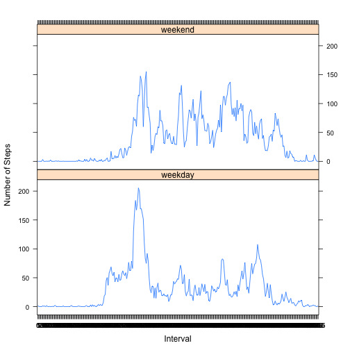

# Reproducible Research: Peer Assessment 1

### Setup some defaults


Note, some global defaults for the RMarkdown processing are set, but not shown, to ensure code chunks are always visible for peer review.

**The final output for this assignment should be generated with: ** ```> knit2html("PA1_template.Rmd")``` via the console.

### Loading and preprocessing the data


```r
library(data.table)
unzip("activity.zip")
my_data <- read.csv("activity.csv")
my_data$date <- as.Date(my_data['date'][,], format="%Y-%m-%d")
my_data$interval <- as.factor(my_data$interval)
my_data <- data.table(my_data) ##Used for grouping
str(my_data)
```

```
## Classes 'data.table' and 'data.frame':	17568 obs. of  3 variables:
##  $ steps   : int  NA NA NA NA NA NA NA NA NA NA ...
##  $ date    : Date, format: "2012-10-01" "2012-10-01" ...
##  $ interval: Factor w/ 288 levels "0","5","10","15",..: 1 2 3 4 5 6 7 8 9 10 ...
##  - attr(*, ".internal.selfref")=<externalptr>
```

For post-processing dates are converted into a ``Date`` object and the intervals are converted into a ``factor``, and a ``data.table, data.frame`` object is used to facilitate further analysis.

**Next we will explore the data with a series of questions:**  
1. What is the mean total number of steps taken per day?  
2. What is the average daily activity pattern?  
3. Imputing missing values  
4. Are there differences in activity patterns between weekdays and weekends?  

### 1: What is mean total number of steps taken per day?

    For this part of the assignment, you can ignore the missing values in the dataset.  
        1. Make a histogram of the total number of steps taken each day  
        2. Calculate and report the mean and median total number of steps taken per day  

For this section, it was assumed that 'ignoring' ```NA``` values meant accepting the default behavior (e.g. when graphing) or excluding them from the calculations.

### Histogram of the Total Steps each Day

1. A histogram of the data is:

```r
hist( my_data[, sum(steps), by=c("date")][['V1']], breaks=15,
    ylab = "Frequency", xlab="Daily Steps", 
    main = "Total Daily Steps by Frequency")
```

 

#### Mean Total Steps

According to [this guidance](https://class.coursera.org/repdata-010/forum/thread?thread_id=12) from the course forums a single number (overall mean based on the day's total steps) is the correct answer.

2a. The overall mean value for the data, based on each day's total is: 

```r
original_mean <- mean(na.omit(my_data)[, sum(steps), by=c("date")][['V1']])
original_mean
```

```
## [1] 10766.19
```

*This utilizes na.omit() to omit ```NA``` values.*

2b. The overall median value for the data is:

```r
original_median <- median(na.omit(my_data)[, sum(steps), by=c("date")][['V1']])
original_median
```

```
## [1] 10765
```

*This utilizes na.omit() to omit ```NA``` values.*

### 2: What is the average daily activity pattern?

The average daily activity pattern is calculated by summarizing the average steps per day, and then visualizing via a graph, with the overall daily average, rounded to 2 decimal points, represented as a red horizontal line.


```r
averages <- my_data[, mean(steps), by=c("date")]
overall_average <- mean(averages[['V1']], na.rm=TRUE)

plot(averages, ylab="Ave. Steps", xlab="Date")
title("Average Steps per Day")
abline(h=overall_average, col=2)
```

 

The overall average is ``37.3825996``.

### 3: Imputing missing values

There are a number of days/intervals where there are missing values (coded as ```NA```).

In theory, the presence of missing days may introduce bias into some calculations or summaries of the data. In practice, having used fitness/pedometer trackers, I would expect a missing value to represent 'no steps' (as in the system was not used that day) - so a missing value seems 'appropriate'.

**However, for the purposes of this exercise, we will assume that an ```NA``` value should be replaced with the average value (of existing values) for that interval.**

Within this dataset there are ``2304`` missing values (i.e. the total number of rows with ```NA``` values).

My strategy will be to calculate the average number of steps, per interval, for values that are present and use this as a 'lookup table' to fill in missing values. For example, if the average daily steps (of present values) for the ```00:05``` interval is ```2```, then any row with ```NA``` will be replaced with this value. These values will be updated in a dataset called ```new_data``` to ensure the original ```my_data``` variable is unmodified.

**```new_data``` will then be used for all subsequent calculations.**

#### Imputing Data into a new dataset

```r
ave_interval_steps <- my_data[, median(steps, na.rm=TRUE), by=c("interval")]
new_data <- data.table(my_data)

## I know this is non-R-like, but I could find no info on how data.tables are
##      coerced to function arguments for an apply(...) approach.
for ( row in 1:nrow(new_data) ) {
    if ( is.na(new_data[row]$steps) ) {
        i <- new_data[row]$interval
        val <- ave_interval_steps[ ave_interval_steps$interval == i ][['V1']]
        new_data[row]$steps <- val
    }
}
```
**Warning: RMarkdown/knitr's ```cache=TRUE``` is used to speed up this computation.**

*This calculation may take some time as it relies on R's inefficient loop system*

### A histogram of the new total number of steps taken each day.

The histogram of the **new** data is:

```r
hist( new_data[, sum(steps), by=c("date")][['V1']], breaks=15,
    ylab = "Frequency", xlab="Daily Steps", 
    main = "Total Daily Steps by Frequency")
```

 

The **new** mean and median total number of steps taken per day, based on this ```new_data``` is:

```r
new_mean <- mean(na.omit(new_data)[, sum(steps), by=c("date")][['V1']])
new_median <- median(na.omit(new_data)[, sum(steps), by=c("date")][['V1']])
```

The ```new_mean``` is ``9503.8688525``, which differs from the original value by ``-1262.3198268``.

The ```new_median``` is ``10395``, which differs from the original value by ``-370``.

Clearly the impact of imputing missing data based on estimates of the total number of steps - *which is then averaged* - each day/interval is to 'drag' the overall mean/median lower, due to the values being calculated over more days.

Previously, there were ``2304`` missing values, whereas the calculation are now performed over the full ``17568`` observations.

### 4: Are there differences in activity patterns between weekdays and weekends?

    Create a new factor variable in the dataset with two levels -- "weekday" and "weekend" indicating whether a given date is a weekday or weekend day.
    Make a panel plot containing a time series plot (i.e. type = "l") of the 5-minute interval (x-axis) and the average number of steps taken, averaged across all weekday days or weekend days (y-axis).
    

```r
library(lattice)
new_data$DayofWeek <- weekdays(new_data$date) ##This could be deleted later but it's not critical
new_data$wd_we <- as.factor( c("weekday", "weekend") )

#Set all of the values to Weekday (covers ~5/7 of the dates)
new_data[,][['wd_we']] <- "weekday"
#Clean up just the two weekend days
new_data[ new_data$DayofWeek == "Saturday" ][['wd_we']] <- "weekend"
new_data[ new_data$DayofWeek == "Sunday" ][['wd_we']] <- "weekend"
## Here is where we could delete via new_data$DayofWeek <- NULL

#Create a Summary - by interval and by weekend/weekday factor.
summary <- new_data[, mean(steps), by=c("interval", "wd_we")]

xyplot(V1 ~ interval | wd_we, data = summary, layout = c(1, 2), type="l",
       ylab="Number of Steps", xlab="Interval")
```

 

Based on the plots, there appears to be more variability in the average (mean) number of steps during invervals on weekend days.

From the data it appears as though the activity is similar for the first third of the day, e.g. sleeping in the morning, getting up, etc. However around mid-day there is a fairly distinct separation between the plots, with the weekend data showing more overall activity (both in number and magnitude of spikes), where as the weekday data seems consistent with a desk-bound/office-worker type behavior (e.g. minimal activity over lunch and sedentary until the late afternoon).
